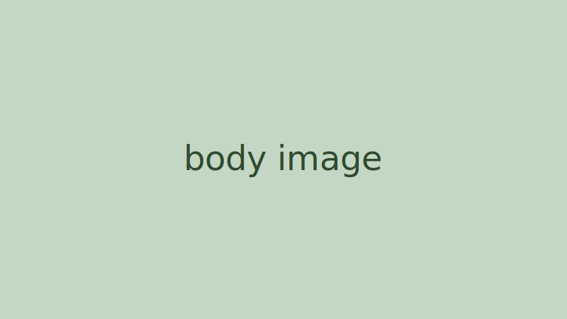

This post is the **CI measurement target** (implementation-plan §3.5). It is
`draft: true`, so production builds exclude it (acceptance B5); CI builds with
`--buildDrafts` so Lighthouse, pa11y, and htmltest measure the real post
template before Sanity exists. It exercises every block type the `blogPost`
schema allows (PRD §2.3): paragraphs, headings, code with language, images,
and lists.

## A second-level heading

A paragraph with **bold text**, *italic text*, `inline code`, and an
[internal link](/blog/) plus an [external link](https://gohugo.io/).

### A third-level heading

An unordered list:

- First item
- Second item with a nested list:
  - Nested item one
  - Nested item two
- Third item

An ordered list:

1. Step one
2. Step two
3. Step three

## Code with language

```python
def greet(name: str) -> str:
    """Fixture code block with syntax highlighting."""
    return f"Hello, {name}!"
```

```js
// A second language to exercise the highlighter
const posts = await fetch("/api/posts").then((r) => r.json());
```

## Image block



## Blockquote

> The walking skeleton needs one content type, not three.
> — PRD §1, decision 7

A closing paragraph so the template's end-of-article spacing is measured.
